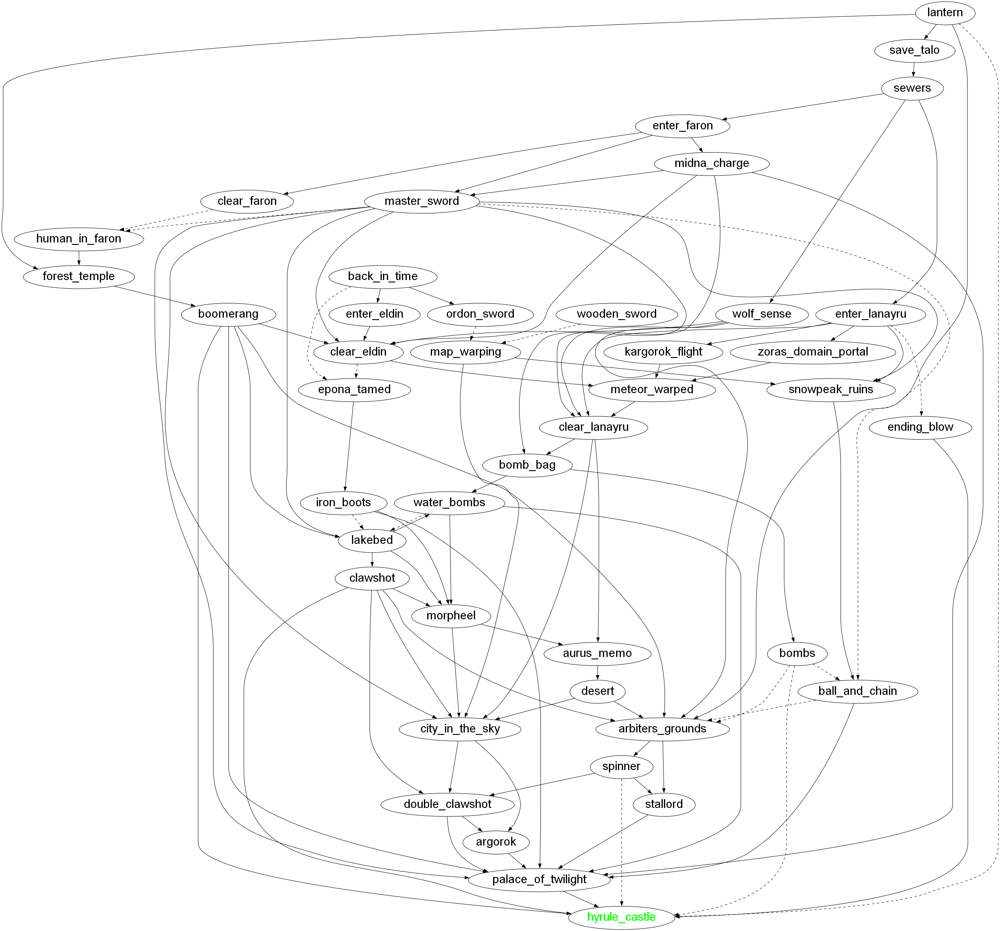

# Twilight Princess Minimum Requirements

- Solid lines represent a hard requirement, all solid lines into a node are needed for that node
- Dashed lines represent a weak requirement, meaning the same requirement could be achieved with other dashed lines (or a combination of other dashed and solid lines)

